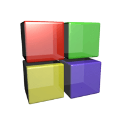
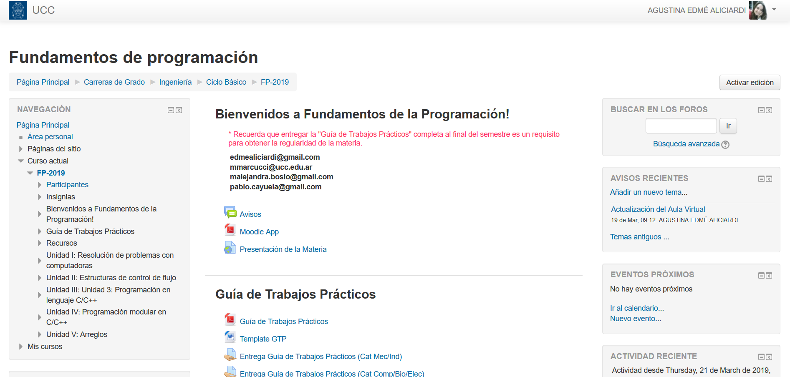

# Fundamentos de la Programación
<small>
Created by <i class="fab fa-telegram"></i>
[edme88]("https://t.me/edme88") & 
<i class="fab fa-telegram"></i>
[rmarku]("https://t.me/rmarku")
</small>

---
## Profes
Ing. Agustina Edmé Aliciardi

&#101;&#100;&#109;&#101;&#97;&#108;&#105;&#99;&#105;&#97;&#114;&#100;&#105;&#64;&#103;&#109;&#97;&#105;&#108;&#46;&#99;&#111;&#109;

Ing. Alejandra Bosio 

malejandra.bosio@gmail.com

Ing. Pablo Cayuela

pablo.cayuela@gmail.com

---
## UNIDADES
**Unidad 1:** Resolución de Problemas con Computadoras

**Unidad 2:** Estructuras de Control de Flujo

**Unidad 3:** Programación en Lenguaje C/C++

**Unidad 4:** Programación modular en C/C++

---
## Calendario
<!-- .slide: style="font-size: 0.5em" -->
| Semana | Unidad | Tema |
|--------|--------|------|
| 1 | 1 | Solución de Problemas usando la computadora   Diagramas de Flujo   Pseudocódigo |
| 2 | 1 | Programación Estructurada |
| 3 | 2 | Estructuras de Control Selectivas |
| 4 | 2 | Estructuras de Control Iterativas |
| 5,6 y 7 | 3 | Programación en Lenguaje C/C++ |
| 8 | 1,2 y 3 | Repaso del 1er Parcial |
| 9 |  | 1er PARCIAL |
| 10,11,12 y 13 | 4 | Programación Modular |
| 14 |  | Repaso del 2do Parcial |
| 15 |  | 2do PARCIAL |
| 16 |  | Recuperatorios |

---
## Forma de Evaluación
* Carpeta de Trabajos prácticos
* Parciales
* Examen Final

---
## Regularidad y Promoción
* Asistencia del 70% en Clases Teórico-Prácticas
* Parciales aprobados (nota mínima de 4)
* Se puede recuperar 1 Parcial
* Carpeta de Trabajos Prácticos Aprobada
* Promocion de la parte Teórica (Promedio >= 8 y nota mínima 7)

---
## [Libros](https://docs.google.com/forms/d/e/1FAIpQLSezpBBGuPAQHOfKVR-zgtZ4nlKHFDRS-L4u4JSzuaB6h1MzuQ/viewform)

“Metodología de la Programación: Algoritmos, diagramas de flujo y programas”  
de Osvaldo Cairó
    
“Fundamentos de Programación. Piensa en C.”  
de Osvaldo Cairó
    
---
## APP:

[SoloLearn](https://play.google.com/store/apps/details?id=com.sololearn&hl=es_419)
    
---
## Soft:

[Code::Blocks](http://www.codeblocks.org)

---
## Soft:

---
## Aula Virtual

---
## ¿Dudas, Preguntas, Comentarios?

