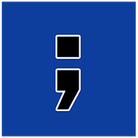
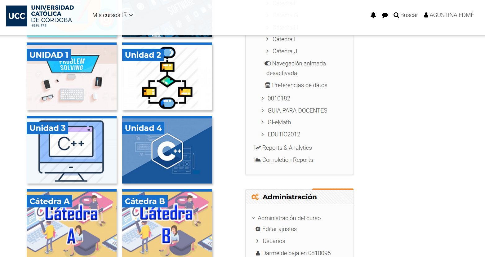
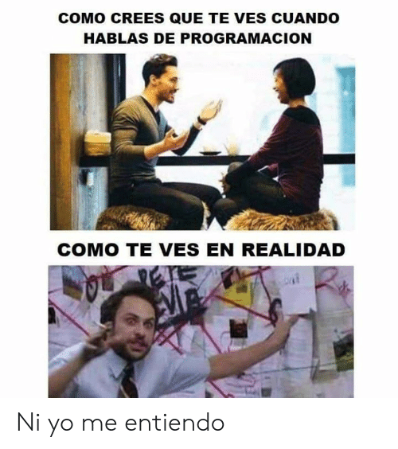

## Fundamentos de la Programación

Created by [edme88](https://t.me/edme88)

---
## Profes

Ing. Eduardo De Lima

1938033@ucc.edu.ar

<small> Cátedra A (Ing. Industrial A-E) </small>  
<small> Cátedra G (Ing. Industrial F-G) </small>

Ing. Nicolás Rodriguez

<small> Cátedra B (Ing. en Sistemas) </small>

---
## Profes
Ing. Agustina Edmé Aliciardi

agustina.aliciardi@ucc.edu.ar

<small> Cátedra C (Ing. Mecánica) </small>

Ing. Pablo Cayuela

1022283@ucc.edu.ar

<small> Cátedra D (Ing. Industrial M-Z) </small>  
<small> Cátedra E (Ing. en Sistemas) </small>

---
## Profes
Ing. Nicolás Grupe

1507101@ucc.edu.ar

<small> Cátedra F (Ing. en Sistemas) </small>
<small> Cátedra H (Ing. Civil) </small>

Ing. Laura Pognante

1514362@ucc.edu.ar

Ing. Nicolás Kolbelt

1502060@ucc.edu.ar

<small> Cátedra I </small>

---
## Profes
Ing. Benajmín Marcolongo
<small> Cátedra J (Ing. en Computación - Ing. Electrónica - Lic. en Bioinformática) </small>

---
## UNIDADES
**Unidad 1:** Resolución de Problemas con Computadoras

**Unidad 2:** Estructuras de Control de Flujo

**Unidad 3:** Programación en Lenguaje C/C++

**Unidad 4:** Programación modular en C/C++

---
## Calendario
<!-- .slide: style="font-size: 0.5em" -->
| Semana | Unidad | Tema |
|--------|--------|------|
| 1 | 1 | Solución de Problemas usando la computadora |
| 2 | 1 | Diagramas de Flujo   Pseudocódigo |
| 3 | 2 | Programación Estructurada |
| 4 | 2 | Estructuras de Control Selectivas |
| 5 y 6 | 2 | Estructuras de Control Iterativas |
| 7 | 1 y 2 | 1er PARCIAL |
| 8 | 3 | Programación en Lenguaje C/C++ |
| 9 | 3 | C++: Control Selectivas |
| 10 | 3 | C++: Control Iterativas |
| 11 | 4 | Programación Modular |
| 12 | 3 y 4 | Repaso |
| 13 | 3 y 4 | 2do PARCIAL |

---
## Forma de Evaluación
* Parciales
* Examen Final

---
## Regularidad
* Asistencia del 70% en Clases Teórico-Prácticas
* Parciales aprobados (nota mínima de 4)
* Se puede recuperar 1 Parcial

---
## Promoción
* Asistencia del 70% en Clases Teórico-Prácticas
* Promedio >= 8 y nota mínima 7
* No se puede recuperar NINGUN Parcial

---
## Notas

<small>Tener en cuenta que un 60%=4, 70%=5.5, 80%=7, 90%=8.5</small>

---
## Libros

“Metodología de la Programación: Algoritmos, diagramas de flujo y programas”  
de Osvaldo Cairó
    
“Fundamentos de Programación. Piensa en C.”  
de Osvaldo Cairó

---
## eLibros
["Fundamentos de Programación con la STL"](https://elibro.net/es/ereader/bibliotecas-ucc/48145?page=39)  
de Antonio Garrido Carrillo

[Fundamentos de Programación - Universidad de los Andes](https://universidad-de-los-andes.gitbooks.io/fundamentos-de-programacion/content/)
    
---
## APPs:
No es obligatorio usarlas, pero es material de consulta

[SoloLearn](https://play.google.com/store/apps/details?id=com.sololearn&hl=es_419) - [Pseudocode](https://play.google.com/store/apps/details?id=pe.diegoveloper.pseudocode&hl=es_AR)   
---
## Soft:
Para escribir *Pseudocódigo* y crear *diagramas de flujo*

 
---
## Soft:
Para programar en *C++*

[Code::Blocks](http://www.codeblocks.org)

---
## Aula Virtual

---
#### No teman hacer preguntas, y no se queden con dudas!!!

---
## ¿Dudas, Preguntas, Comentarios?
