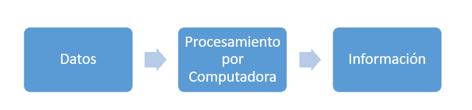
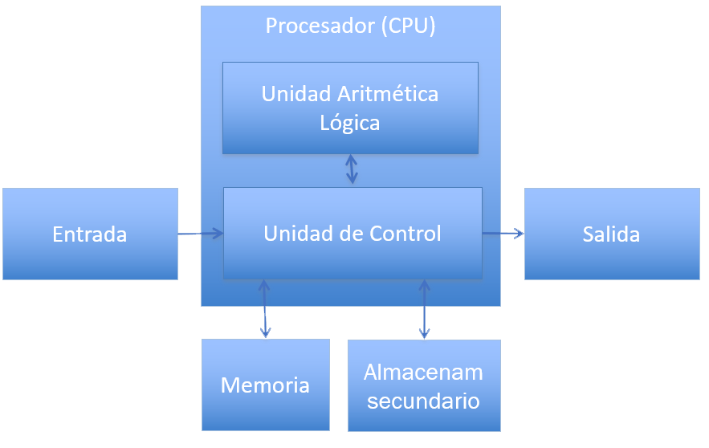
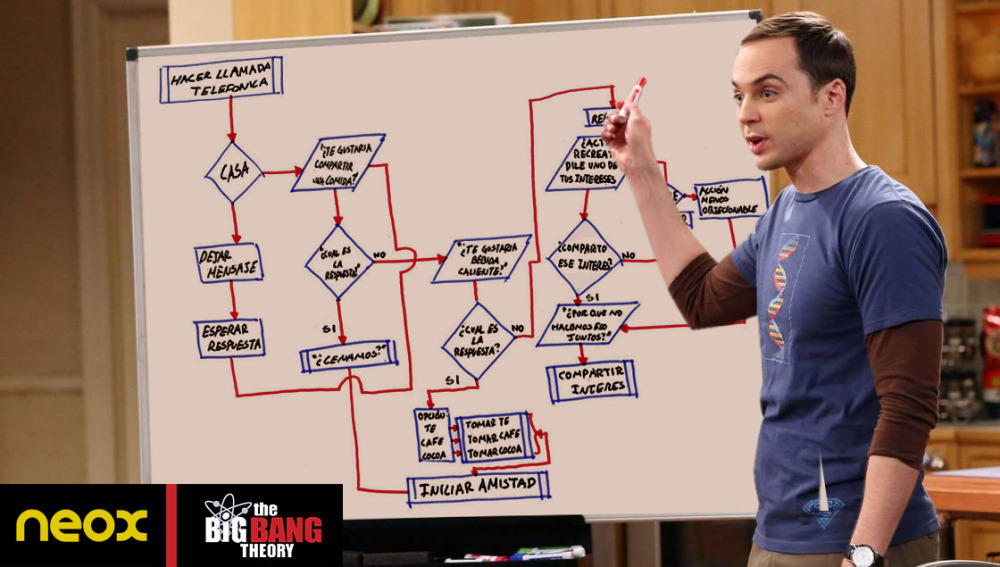

## Resolución de Problemas con Computadoras

Created by [edme88](https://t.me/edme88)

---
## Computadora
* Procesa Datos
* Convierte datos en información

---
## Computadora
Capacidad de:
* Aceptar una  entrada
* Presentar una salida
* Almacenar información
* Ejecutar operaciones aritméticas o lógicas sobre los datos de entrada o de salida

---
## Componentes

---
## Datos e Información
**Datos:** Representación de algún hecho, concepto o entidad real
    
**Información:** Datos procesados y organizados
    
---
## Introducción a la resolucón de Problemas
¿Cómo resuelven un problema (cotidiano)?   (Ej. atarse los cordones, cocinar un plato)
    
¿Usan algun método?

---
#### Ejemplo de como se puede plantear una solución...
##### Sheldon: Diagrama de flujo para hacer amigos
<iframe width="560" height="315" src="https://www.youtube.com/embed/7MAeSbiLRPo?start=106" frameborder="0" allow="accelerometer; autoplay; clipboard-write; encrypted-media; gyroscope; picture-in-picture" allowfullscreen></iframe>

---
#### Ejemplo de como se puede plantear una solución...
##### Sheldon: Diagrama de flujo para hacer amigos

---
### Metodología para la solución de Problemas basados en la Computadora
1. Análisis del problema
2. Diseño del algoritmo
3. Codificación
4. Prueba de escritorio
5. Compilación y Ejecución
6. Prueba y Depuración
7. Interpretación de los resultados
8. Documentación y Mantenimiento

---
## 1-Análisis del problema
Asegurarse de que el problema está bien definido y se comprende claramente.

* Comprender la naturaleza del problema
* Conocer los datos involucrados (datos de entrada, cálculos y fórmulas, datos de salida)
* Determinar la información deseada como resultado del proceso (requerimiento)

---
## 1-Análisis del problema
* ¿Con qué datos cuento?
* ¿Qué hago con esos datos?
* ¿Qué se desea obtener?

---
## 2- Diseño del Algoritmo
Definir la secuencia de pasos que se deben llevar a cabo para conseguir la salida identificada en el paso anterior.
	
Se puede expresar en forma gráfica mediante un diagrama de flujo ó en forma escrita mediante pseudocódigo.

---
## 3- Codificación
Expresar el diagrama de flujo ó pseudocódigo en un lenguaje de alto nivel.

Escribir la solución del problema en  una  serie de instrucciones detalladas, en un código reconocible por la computadora o
**Programa** (empleando un Lenguaje de programación).

---
## 4- Prueba de escritorio
Consiste en simular manualmente las operaciones que se indican en el programa. 
Mediante una tabla se hace una traza de los valores que van tomando las variables hasta obtener los resultados.
Se puede aplicar en programas de poca complejidad.

---

---
## 5- Compilación y Ejecución
La computadora verifica si existen errores de sintaxis, y de no ser así produce un programa denominado objeto.
Luego se realiza el **enlace o link** donde se le incorporan las librerias necesarias para ejecutar las sentencias indicadas en el programa.
Se genera el programa.exe que puede ser ejecutado.

---
## 6- Prueba y Depuración
<!-- .slide: style="font-size: 0.8em" -->
Verificar que el programa funciona de manera correcta. 
Descubrir, localizar y corregir los errores que hacen que un programa no se ejecute o que cuando lo hace obtiene resultados erróneos.

Tipos de Errores:
* de Sintaxis: Uso incorrecto de reglas del lenguaje;
* de Ejecución: Operaciones correctas sintácticamente, pero que no pueden ser ejecutadas.
* Lógicos: No se obtienen los resultados deseados por problemas en el algorimo.

---
## 7- Interpretación de los Resultados
El usuario debe interpretar los resultados para ver si realmente son la solución del mismo. 

Se debe comprobar que el programa cumple los requerimientos.

---
## 8- Documentación y Mantenimiento
Guía que sirve como ayuda para usar un programa o facilitar futuras modificaciones. 

Se divide en:
* Documentación para el usuario final
* Documentación técnica

---
## 8- Documentación y Mantenimiento
Documentación para el usuario final:
* Descripción del Programa
* Descripción de los datos requeridos y los resultados obtenidos
* Descripción de los comandos y funciones
* Descripción de los mensajes de error 
* Limitaciones del programa
* Manual de usuario 

---
## 8- Documentación y Mantenimiento
Documentación técnica:
* Diseño global
* Descripción de las funciones y procedimientos
* Diagramas de flujo, descripción de las variables y módulos, etc

---
## 8- Documentación y Mantenimiento
El mantenimiento se realiza cuando se detecta la necesidad de realizar un cambio o ajuste al programa para que siga trabajando
de manera correcta.

---
## Introducción a los Algoritmos
¿Qué les parece que es un algoritmo?
    
¿Cómo lo definirían con sus palabras?
    
---
## Algoritmo: Concepto
Es un método para resolver un problema, que consiste en la realización de un conjunto de pasos, procedimientos o acciones 
lógicamente ordenados tal que, partiendo de ciertos datos de entrada, permite obtener ciertos resultados que conforman la solución del problema.
    
Un determinado problema puede resolverse mediante más de un algoritmo.
Aun si todos encuentran la solución correcta  algunos serán mejores que otros.
    
---
## Secciones o Módulos de un Algoritmo
1. Ingreso de datos del Problema
2. Procesamiento de Datos
3. Impresión de Resultados

---
## Ejemplo: Área del Rectángulo
1. Qué datos debería ingresar el usuario?
2. Que procesamiento se realizará sobre los datos?
3. Cuál es el resultado esperado?

---
## Características de los Algortimos
<!-- .slide: style="font-size: 0.9em" -->
* **Correcto:** resuelve el problema
* **Eficiente:** en uso de recursos y tiempo
* **Preciso:** no ambiguo, la actividad a realizar  en cada paso debe ser clara.
* **Determinista:** debe comportarse del mismo modo ante las mismas condiciones. Si se sigue dos veces en el mismo entorno, el resultado obtenido es el mismo.
* **Finito:** Tiene fin tras un número determinado de pasos.
* **Legible:** Fácil de leer y comprender

---
## Herramientas para la representación de un Algoritmo
* Diagrama de Flujo
* Diagramas N-S (Nassi-Schneiderman)
* Pseudocódigo

---
## ¿Dudas, Preguntas, Comentarios?

