# Diagramas de Flujo y N-S
<small>
Created by <i class="fab fa-telegram"></i>
[edme88]("https://t.me/edme88")
</small>

---
## Diagramas de Flujo
¿Qué les parece que es un diagrama de flujo?

¿Cómo lo definirían con sus palabras?
    
---
## Diagrama de Flujo
Representa la esquematización gráfica de un algoritmo.

Muestra gráficamente los pasos o procesos a seguir para alcanzar la solución de un problema.
    
A partir del mismo se escribe un programa en algún lenguaje de programación.

---
## Diagrama de Flujo
* Se utilizan símbolos (cajas) estándar que representan los pasos del algoritmo
* Unidos por flechas: líneas de flujo
* Los símbolos están normalizados

---
### Simbolos de Diagrama de Flujo
<!-- .slide: style="font-size: 0.8em" -->
| Simbolo | Explicación |
|---------|-------------|
|  | Marcar el inicio y el fin del diagrama de flujo. |
| 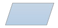 | Introducir los datos de entrada.  Expresa lectura. |
|  | Expresa procesos: asignaciones, operaciones aritméticas, cambios de valor de celdas en memoria, etc |

---
## Simbolos de Diagrama de Flujo
<!-- .slide: style="font-size: 0.8em" -->
| Simbolo | Explicación |
|---------|-------------|
| 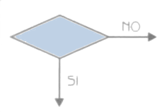 | Condición, dependiendo del resultado de la evaluación de la misma se sigue por una de las ramas o caminos alternativos. Se utiliza para if, while, do while. |
| 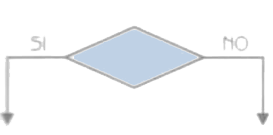 | Selectiva  doble si  entonces/sino. Condición. El resultado es verdadero se continúa por el camino de la Izquerda, y si es falso por el camino de la derecha. Se utiliza para if else. |

---
## Simbolos de Diagrama de Flujo
<!-- .slide: style="font-size: 0.8em" -->
| Simbolo | Explicación |
|---------|-------------|
| 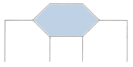 | Representar una decisión múltiple.  En su Interior se almacena un selector, y dependiendo del valor de dicho selector se sigue por una de las ramas o caminos alternativos.    Se utiliza para switch (case)|

---
## Simbolos de Diagrama de Flujo
<!-- .slide: style="font-size: 0.8em" -->
| Simbolo | Explicación |
|---------|-------------|
|  | Representar la Impresión de un resultado.  Expresa escritura. |
|  | Expresar la dirección del flujo del diagrama |
|  | Expresar conexión dentro de una misma página |

---
## Simbolos de Diagrama de Flujo
<!-- .slide: style="font-size: 0.8em" -->
| Simbolo | Explicación |
|---------|-------------|
|  | Expresar conexión entre páginas diferentes |
|  | Expresar un módulo de un problema. Para continuar con el flujo normal del diagrama debemos primero resolver el subproblema que enuncia en su Interior |

---
## Diagrama de Flujo Básico
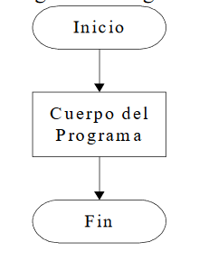

---
### Diagrama de Flujo Básico
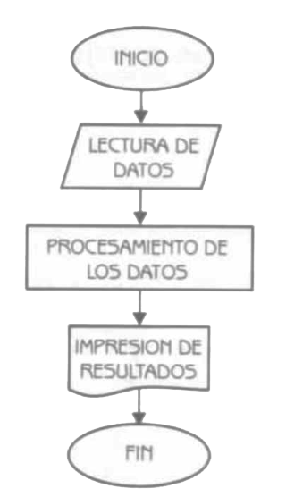

---
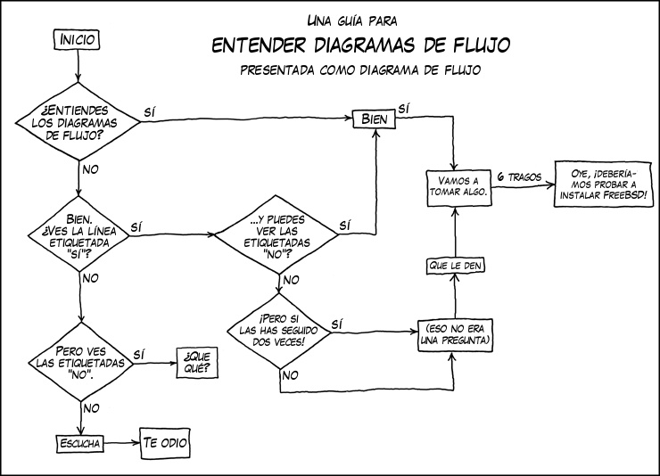

---
### Reglas de DF
* Debe tener un inicio y un fin.
* Las líneas utilizadas para indicar la dirección del flujo del diagrama deben ser rectas, verticales y horizontales. (no inclinadas)
* Todas las líneas utilizadas para indicar la dirección del flujo del diagrama deben estar conectadas.
La conexión puede ser a un símbolo que exprese lectura, proceso, decisión, impresión, conexión o fin de diagrama.

---
### Reglas de DF
* El diagrama de flujo debe ser construido de arriba hacia abajo (top-down) y de izquierda a derecha (right to left). 
* La notación utilizada en el diagrama de flujo debe ser independiente del lenguaje de programación. 
* Es conveniente cuando realizamos una tarea compleja poner comentarios que expresen o ayuden a entender lo que hicimos. 

---
### Reglas de DF
<!-- .slide: style="font-size: 0.8em" -->
* Si el diagrama de flujo requiriera más de una hoja para su construcción, debemos utilizar los conectores adecuados y enumerar las páginas convenientemente.
* No puede llegar más de una línea a un símbolo.

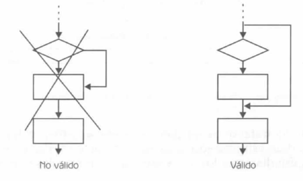

---
### Diagramas N-S
Como el diagrama de flujo, pero se omiten líneas de flujo (flujo siempre es descendente) y las cajas son contiguas.
    
También conocido como diagrama de chaplin.

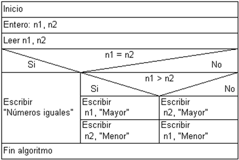

---
### Diagramas N-S
También es conocido como **Estructurograma**, ya que sirve para representar la estructura del programa.

Combina la descripción textual del pseudocódigo con la representación gráfica del diagrama de flujo

---
### Diagramas N-S: Caracteristicas
* En la primera caja va el **Inicio**
* La última instrucción es el **fin**
* Todas las declaraciones de variables y funciones se realizan bajo el inicio

---
### Diagramas N-S: Estructuras de Decision
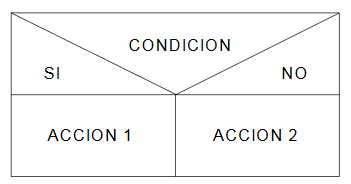
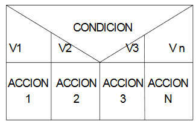

* Doble
* Multiple

---
#### Diagramas N-S: Estructuras Iterativas
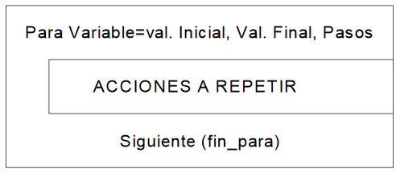
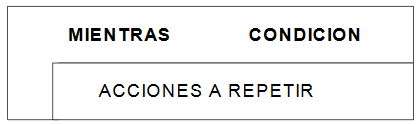
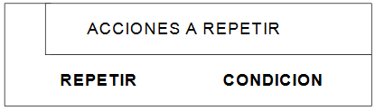

* Desde-Hasta
* Hacer-Mientras
* Repetir-Hasta

---
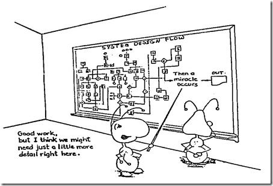

---
## ¿Dudas, Preguntas, Comentarios?

