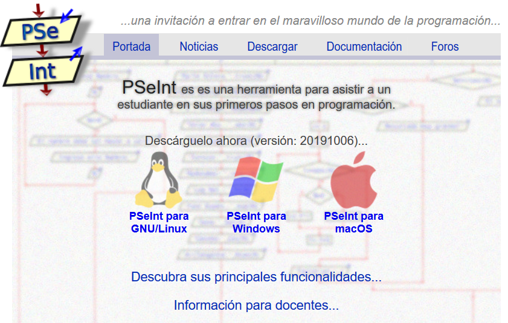
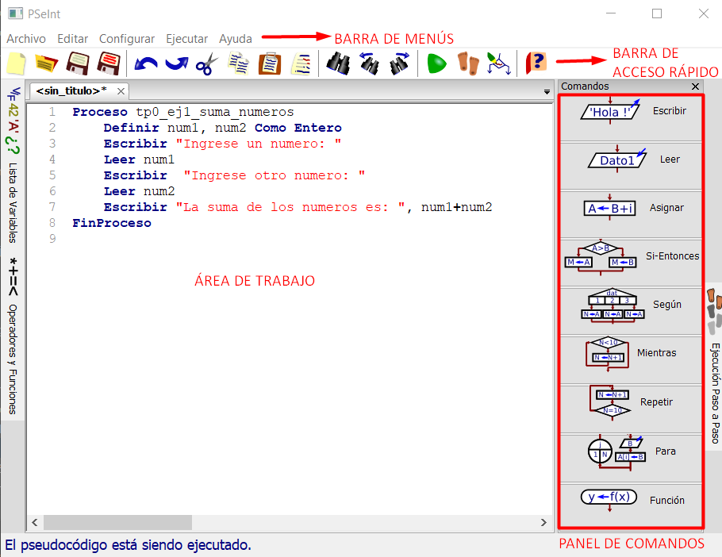
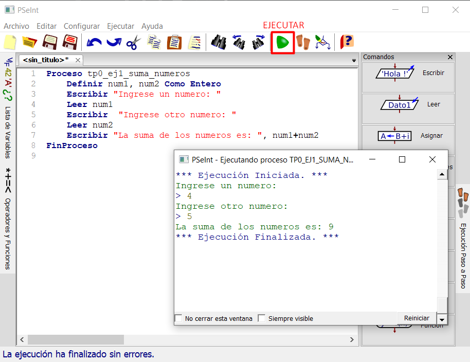
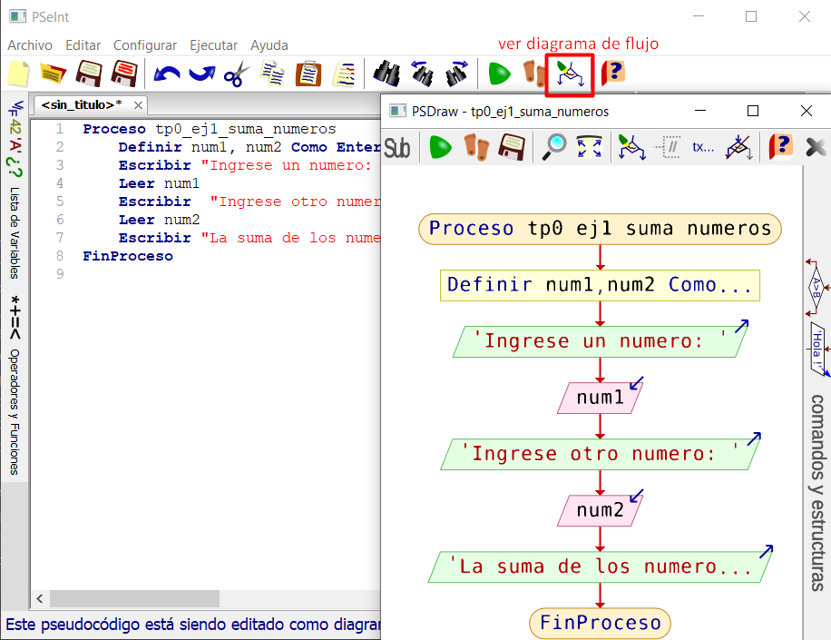
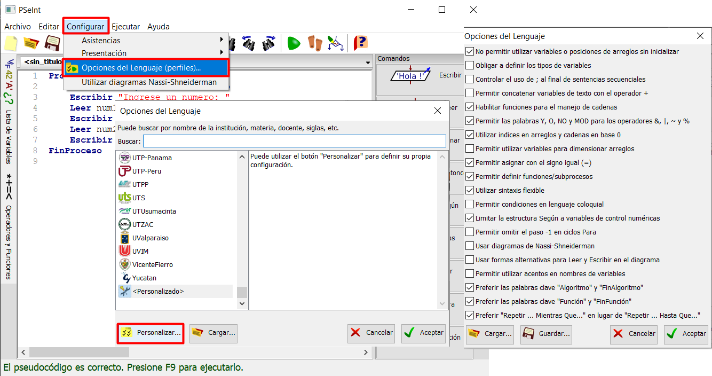
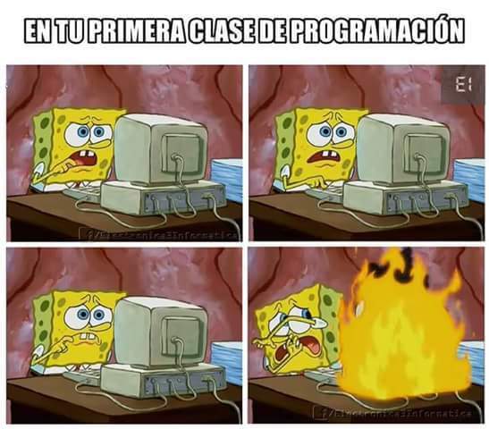

## Pseudocódigo
<small>
Created by <i class="fab fa-telegram"></i>
[edme88]("https://t.me/edme88")
</small>

---
## Pseudocódigo

¿Qué les parece que es el pseudocódigo?

¿Cómo lo definirían con sus palabras?

¿Conocen la etimología de la palabra?

---
## Pseudocódigo: Concepto
Es un "falso lenguaje", que tiene  una  estructura  muy similar al lenguaje natural y sirve para poder expresar algoritmos y programas de forma independiente del lenguaje de programación.

---
## Pseudocódigo: Ejemplo
````javascript
Proceso tp0_ej1_suma_numeros
	Definir num1, num2 Como Entero
	Escribir "Ingrese un numero: "
	Leer num1
	Escribir  "Ingrese otro numero: "
	Leer num2
	Escribir "La suma de los numeros es: ", num1+num2
FinProceso
````
---
## Pseudocódigo: Ventajas
* Comunicar y representar ideas que puedan ser entendidas por programadores que conozcan distintos lenguajes.
* El programador puede concentrarse en la lógica y estructuras de control y no preocuparse de las reglas de un lenguaje de programación específico.

---
## Pseudocódigo: Ejercicio
Traducir el anterior Pseudocódigo a un diagrama de flujo.

---
## Programa: Pseint
Descargue PSeint de http://pseint.sourceforge.net


---
## Pseint: Pantalla Inicial
El PSeInt presenta la siguiente pantalla


---
## Pseint: Ejecutar Programa
<!-- .slide: style="font-size: 0.8em" -->
Botón de Ejecutar en la barra de acceso rápido


---
## Pseint: Ver diagrama


---
## Pseint: Configuración
<!-- .slide: style="font-size: 0.8em" -->
1. En Configurar > Opciones del Lenguaje (perfiles)...
2. Personalizar
3. Seleccionar checkbox según imagen


---
## Buenas Prácticas
* Haz que tu código sea **Legible**
* Coloca comentarios en el código
* Prueba el funcionamiento de tu programa en varios casos distintos
* Primero plantear el problema en papel si es necesario
* Nombres de variables transparentes y claros

---
## Primera Clase


---
## ¿Dudas, Preguntas, Comentarios?

