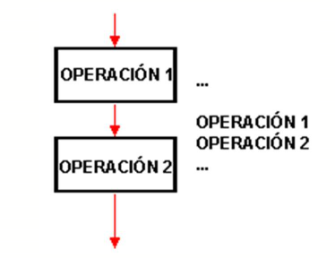

# Pseudocódigo
<small>
Created by <i class="fab fa-telegram"></i>
[edme88]("https://t.me/edme88")
</small>

---
## Pseudocódigo

¿Qué les parece que es el pseudocódigo?

¿Cómo lo definirían con sus palabras?

¿Conocen la etimología de la palabra?

---
## Pseudocódigo: Concepto
Es un "falso lenguaje", que tiene  una  estructura  muy similar al lenguaje natural y sirve para poder expresar algoritmos y programas de forma independiente del lenguaje de programación.

---
## Pseudocódigo: Ejemplo
````javascript
Inicio
   a = 0;
   b = 0;
   repita
Escribir "Introduzca el primer número"
leer -> a
si a no es un numero entonces
    Escribir a " no es un valor válido, intente de nuevo."
fin si
       hasta a es un numero
       repita
Escribir "Introduzca el segundo número"
leer -> b
si b no es un numero entonces
    Escribir b " no es un valor válido, intente de nuevo."
fin si
hasta b es un numero
   c = a + b
   Escribir "La suma de " a " y " b " es " c
Fin
````
---
## Pseudocódigo: Ventajas
* Comunicar y representar ideas que puedan ser entendidas por programadores que conozcan distintos lenguajes.
* El programador puede concentrarse en la lógica y estructuras de control y no preocuparse de las reglas de un lenguaje de programación específico.

---
## Pseudocódigo: Ejercicio
Traducir el anterior Pseudocódigo a un diagrama de flujo.

---
## Estructura de un Programa
Un programa puede ser escrito utilizando tres tipos de estructuras de control:
* Secuenciales
* Selectivas o de decisión
* Repetitivas

---
## Estructura de un Programa
Las  Estructuras  de  Control  determinan  el  orden  en  que  deben  ejecutarse  las  instrucciones  de  un algoritmo: si serán recorridas una luego de la otra, si habrá que tomar decisiones sobre si ejecutar o no alguna acción o si habrá repeticiones.

---
## Estructura Secuencial
Es la estructura en donde una acción (instrucción) sigue a otra de manera secuencial.

Las tareas se dan de tal forma que la salida de una es la entrada de la que sigue y así en lo sucesivo hasta cumplir con todo el proceso.

Esta estructura de control es la más simple, permite que las instrucciones que la constituyen se ejecuten una tras otra en el orden en que se listan.

---
## Estructura Secuencial



---
## ¿Dudas, Preguntas, Comentarios?

