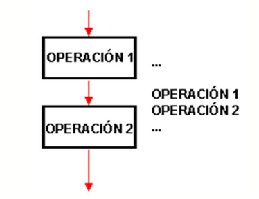

# Estructura Secuencial

Created by <i class="fab fa-telegram"></i>
[edme88](https://t.me/edme88)

---
## Estructura de un Programa
Un programa puede ser escrito utilizando tres tipos de estructuras de control:
* Secuenciales
* Selectivas o de decisión
* Repetitivas

---
## Estructura de un Programa
Las  Estructuras  de  Control  determinan  el  orden  en  que  deben  ejecutarse  las  instrucciones  de  un algoritmo: si serán recorridas una luego de la otra, si habrá que tomar decisiones sobre si ejecutar o no alguna acción o si habrá repeticiones.

---
## Estructura Secuencial
Es la estructura en donde una acción (instrucción) sigue a otra de manera secuencial.

Las tareas se dan de tal forma que la salida de una es la entrada de la que sigue y así en lo sucesivo hasta cumplir con todo el proceso.

Esta estructura de control es la más simple, permite que las instrucciones que la constituyen se ejecuten una tras otra en el orden en que se listan.

---
## Estructura Secuencial



---
#### Ejemplo de Estructura Secuencial
````javascript
Algoritmo calculo_raices
	Definir a,b,c,det,x1,x2 como real
	Escribir "Ingrese a:"
	Leer a
	Escribir "Ingrese b:"
	Leer b
	Escribir "Ingrese c:"
	Leer c
	det=b*b-4*a*c
	x1=(-b+RAIZ(det))/(2*a)
	x2=(-b-RAIZ(det))/(2*a)
	Escribir "Las raices son ", x1," y ", x2
FinAlgoritmo
````

---
## Estructura Secuencial: Acciones
* Asignación
* Operaciones Aritméticas
* Lectura
* Escritura

---
## Operador de Asignación
Se utiliza para asignar un valor a una variable o a una constante.

El signo que representa la asignación es el **=** y este operador indica que el valor a la derecha del = será asignado a lo que está a la izquierda del mismo.

Ejemplo: int edad=20;

---
## Operador Aritmético
<!-- .slide: style="font-size: 0.9em" -->
Son operadores binarios (requieren siempre dos operandos) que realizan las operaciones aritméticas habituales entre números, constantes o variables.

| Operador | Significado | 
|----------|-------------|
| + | Suma |
| - | Resta |
| * | Producto |
| / | División |
| % | Resto de División entera |

---
## Ejercicios
Resuelve los ejercicios del **[Trabajo Practico I](https://ucc-fundamentosprogramacion.github.io/GTP/TP1_ejercicios.html#/1): Diagramas de Flujo y Pseudocódigo de Estructura Secuencial**, del 1 al 22 

---
## ¿Dudas, Preguntas, Comentarios?

