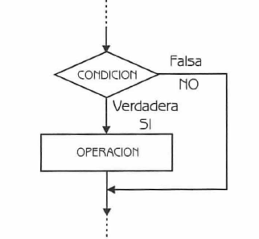
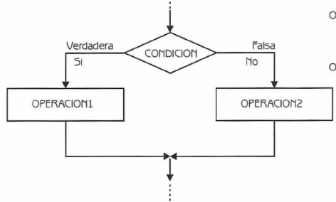
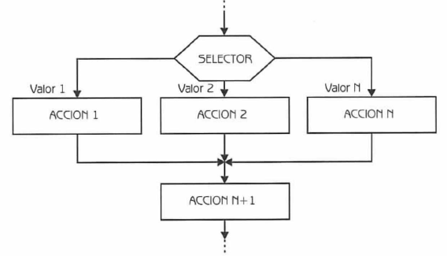
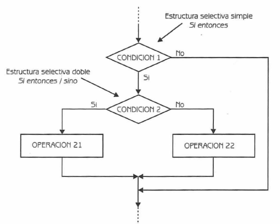
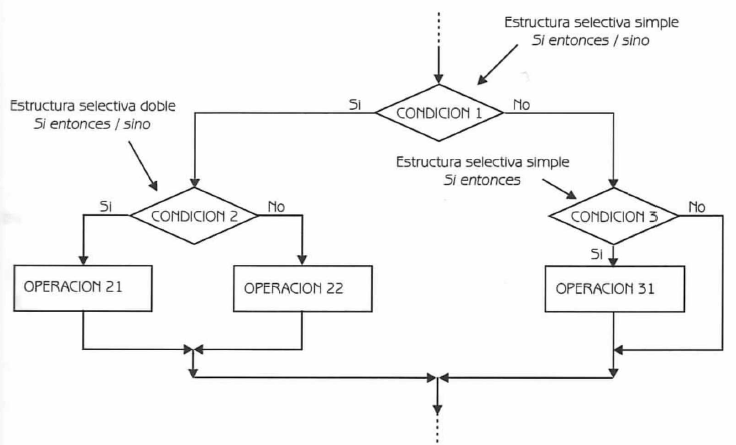
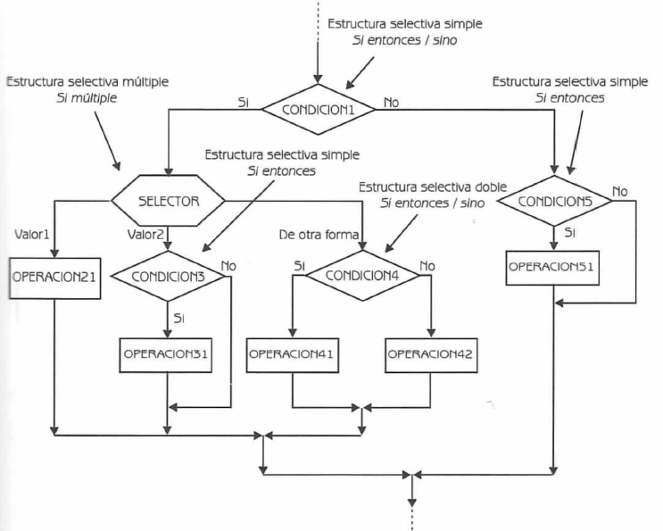

# Estructura de Control de Flujo Condicional
<small>
Created by <i class="fab fa-telegram"></i>
[edme88]("https://t.me/edme88")
</small>

---
## Estructura de un Programa
Un programa puede ser escrito utilizando tres tipos de estructuras de control:
* Secuenciales
* Selectivas o de decisión
* Repetitivas

---
## Estructuras Selectivas
Estructura de control de gran utilidad para cuando el algoritmo a desarrollar presenta un número de posibles alternativas que resultan de la evaluación de una determinada condición.

Este tipo de estructuras son utilizadas para tomar decisiones lógicas, por ello también se denominan estructuras de decisión o alternativa.

---
## Estructuras Selectivas
Hay situaciones en las que la toma de decisiones se realiza en cascada. Es decir se toma una decisión, se marca la rama correspondiente a seguir, se vuelve a tomar otra decisión y así sucesivamente. Por lo que para alcanzar la solución de un problema o subproblema debemos aplicar prácticamente un árbol de decisión.

---
## Tipo de Estructura
Las estructuras selectivas/alternativas pueden ser:
* Simples: if (Si-Entonces)
* Dobles: if-else (Si-Entonces/Sino)
* Múltiples: switch (Si multiple)

---
## Alternativa Simple


---
## Alternativa Simple (si-entonces/if-then)
Lleva a cabo una acción al cumplirse una determinada condición.

La selección si-entonces evalúa la condición y:
* Si la condición es verdadera, ejecuta la operación
* Si la condición es falsa, no ejecuta nada.

---
## Alternativa Simple
| En Espanol | En Inglés |
|------------|-----------|
| Si <condicion> <br> Entonces <acción S1> <br> Fin_Si | If <condicion> <br> Then <acción S1> <br> End_If |

---
## Alternativa Simple
````javascript
INICIO
   ENTERO edad = 18
   SI (edad > 18)
   ENTONCES:
        puede manejar un auto
FIN_SI FIN
```` 

---
## Alternativa Doble


---
## Alternativa Doble (si-entonces-sino/if-then-else)
Permite elegir dos opciones o alternativas posibles, de acuerdo al cumplimiento o no de una determinada condición:
* Si la condición es verdadera, se ejecuta la operación1 
* Si la condición es falsa, se ejecuta la operación2

---
## Alternativa Doble
| En Espanol | En Inglés |
|------------|-----------|
| Si <condicion> <br> Entonces <acción S1> <br> sino <acción S2> <br> Fin_Si | If <condicion> <br> Then <acción S1> <br> else <acción S2> <br> End_If |

---
## Alternativa Doble
````javascript
INICIO
    BOOLEANO afueraLlueve = verdadero
    SI (afueraLlueve es verdadero)
    ENTONCES:
        me quedo viendo Netflix
    SINO:
        salgo al parque a tomar mates
    FIN_SI
FIN
````    

---
## Alternativa Múltiple


---
## Alternativa Múltiple (según sea, caso de/case)
Se utiliza cuando existen más de dos alternativas para elegir.
    
Esto podría solucionarse por medio de estructuras alternativas simples o dobles, anidadas o en cascada.
Esto puede plantear serios problemas de escritura del algoritmo, de comprensión y de legibilidad, si el número de alternativas es grande.

---
## Alternativa Múltiple (según sea, caso de/case)
En esta estructura se evalúa una condición o expresión que puede tomar n valores. Según el valor que la expresión tenga en cada momento se ejecutan las acciones correspondientes al valor.

---
## Alternativa Múltiple
### Pseudpocódigo

````javascript
Según sea <expresión>
        <Valor1>: <Acción1>
        <Valor2>: <Acción2>
        ...........................
[<Otro>: <acciones>]
FIN Según
````

---
## Alternativa Múltiple
 Ejemplo en Pseudpocódigo
 
 ````javascript
INICIO
    ENTERO posicionDeLlegada = 3
    SEGUN SEA posicionDeLlegada
        1: entregar medalla de oro
        2: entregar medalla de plata
        3: entregar medalla de bronce
        otro: entregar mención especial
FIN
````

---
## Alternativa Doble
Cómo desarrollarían el anterior ejemplo en un diagrama de flujo empleando if-then-else?
Cómo sería el pseudocódigo?

---
## Alternativa Doble
Ejemplo en Pseudpocódigo
````javascript
INICIO
  ENTERO posicionDeLlegada = 3
  SI (posicionDeLlegada = 1)
  ENTONCES:
     entregar medalla de oro
  SINO:
     SI (posicionDeLlegada = 2)
     ENTONCES:
        entregar medalla de plata
     SINO:
        SI (posicionDeLlegada = 3)
            ENTONCES:
            entregar medalla de bronce
            SINO:
            entregar mención especial
        FIN_SI
     FIN_SI
  FIN_SI
FIN
````

---
## Estructuras Selectivas en Cascada
Luego de tomar una decisión y marcar el camino correspondiente a seguir, es necesario tomar otra decisión.

---
## Cascada: Ejemplo


---
## Cascada: Ejemplo


---
## Cascada: Ejemplo


---
## Operadores
Son símbolos especiales que sirven para ejecutar una determinada operación, devolviendo el resultado de la misma.
   
Existen diferentes tipos de operadores:
* de Asignación
* Aritméticos
* Unitarios
* Condicionales
* Relacionales
* Lógicos

---
## Operadores Relacionales
Sirven para realizar comparaciones de igualdad, desigualdad y relación de menor o mayor.

<!-- .slide: style="font-size: 0.9em" -->
| Operador | Descripción |
|----------|-------------|
| == | Igual a |
| != | No igual a |
| > | Mayor que |
| >= | Mayor o igual que |
| < | Menor que |
| <= | Menor o igual que |

---
## Operadores Relacionales
<!-- .slide: style="font-size: 0.7em" -->
| Expresión | Operador | Descripción |
|-----------|----------|-------------|
| a > b | > | true: si a es mayor que b <br> false: si a es menor que b |
| a >= b | >= | true:si a es mayor o igual que b <br> false: si a es menor que |
| a < b | < | true: si a es menor que b <br> false: si a es mayor que b |
| a <= b | <= | true: si a es menor o igual que b <br> false: si a es mayor que b. |
| a == b | == | true: si a y b son iguales.<br> false: si a y b son diferentes |
| a != b | != | true: si a y b son diferentes <br> false: si a y b son iguales. |

---
## Operadores Lógicos
Los operadores lógicos (AND, OR y NOT), sirven para evaluar condiciones complejas.
    
Se utilizan para construir expresiones lógicas, combinando valores lógicos (true y/o false) los  resultados de los operadores relacionales.

---
## Operadores Lógicos
<!-- .slide: style="font-size: 0.8em" -->
| Expresión | Nombre Operador | Operador | Resultado |
|-----------|-----------------|----------|-----------|
| !a | NOT | ! | true: si a es falso. <br> false: si a es verdadero |
| a && b | AND | && | true: si a y b son verdaderos. <br> false: si a es falso, o si b es falso, o si a y b son falsos |
| a !! b | OR | !! | true: si a es verdadero, o si b es verdadero, o si a y b son verdaderos. <br> false: si a y b son falsos |

---
## Expresión
Es una secuencia de operaciones y operandos que especifica un cálculo.

Ejemplo: 3 + 5. En esta expresión, el símbolo más (+) es el operador de suma, y los números 3 y 5 se llaman operandos.

---
## ¿Dudas, Preguntas, Comentarios?

