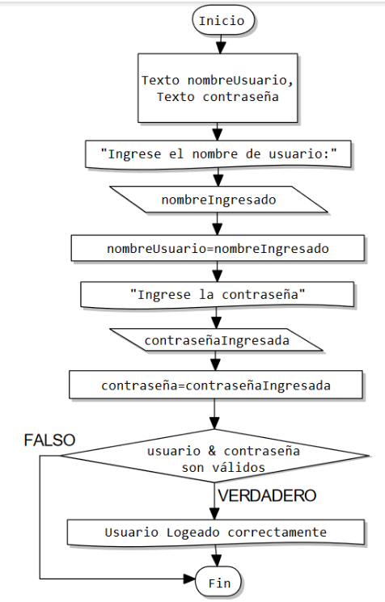
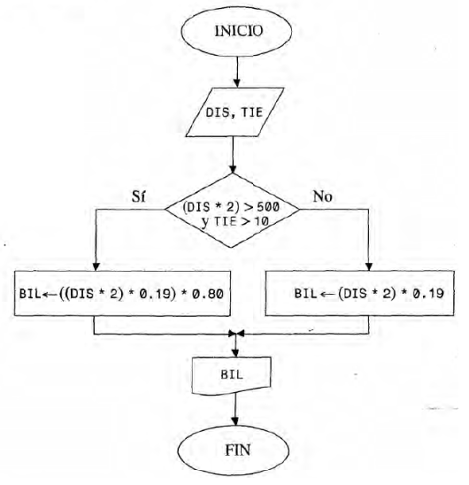

# Ejercicios
### Control de Flujo Condicional
<small>
Created by <i class="fab fa-telegram"></i>
[edme88]("https://t.me/edme88")
</small>

---
### TP1: Ejercicio 1
Determinar la hipotenusa de un triángulo rectángulo conocidas las longitudes de sus dos catetos.

---
### TP2: Alternativa Simple - Ejercicio 1
Permite leer 2 números, A y B. Debe ordenarlos de menor a mayor.
En A siempre debe estar el menor y en B el mayor. Mostrar en pantalla el valor de A.

---
### TP2: Alternativa Doble - Ejercicio 2
Ingrese 2 valores distintos. Determinar cuál de los 2 valores es el mayor y escribirlo.

---
### TP2: Alternativa Múltiple - Ejercicio 3
Ingrese una opción de un menú (para saber si desea realizar la suma, resta, multiplicación o división de 2 números) y 2 números A y B. Muestre por pantalla la operación de ambos números.

---
### TP2: Pseudocodigo - Ejercicio 1
Escriba el pseudocódigo del siguiente diagrama que permite realizar un inicio de sesión de un usuario. Realice una prueba de escritorio.

---

---
### TP2: Pseudocodigo - Ejercicio 2
Conociendo la distancia entre 2 ciudades y el tiempo de estancia en una ciudad, se puede calcular el precio del pasaje de tren. 
Si la distancia total (ida y vuelta) es mayor a 500 Km y estadía es mayor a 10 días, se obtiene un descuento del 20%. El precio por Km recorrido es $0,19.

---

---
### TP5: Alternativa Simple - Ejercicio 1
Permite que el usuario ingrese una nota. Si la misma es igual o mayor a 4, debe aparecer el mensaje: “Aprobado”.

---
### TP5: Ejercicio 2
De acuerdo a la altura de una persona, se le permite entrar a un juego en un parque de diversiones.
Para poder subirse a la montaña rusa, la persona debe medir 1,30 mts o más, caso contrario no puede.

---
### TP5: Ejercicio 3
Al recibir 3 datos de entrada, R, T y Q calcule si los mismos satisfacen la siguiente expresión:
R^4-T^3+4×Q^2<820

---
### TP5: Ejercicio 4
Permite a un cajero ingresar la forma de pago (efectivo o tarjeta) y el monto a pagar. En caso de haber abonado en efectivo, se realizará un descuento del 10%.

---
### TP5: Ejercicio 5
En una empresa se decidió aumentar en un 12% el sueldo de aquellos empleados que cobren menos de $18000.
El programa debe permitir ingresar el sueldo del empleado y si corresponde mostrar el mensaje
“El empleado tiene un aumento. Su nuevo sueldo es:”.

---
### TP5: Ejercicio 6 - Alternativa Doble
Permite leer dos números desde el teclado y determinar el mayor de ellos.

---
### TP5: Ejercicio 7
Permite que el usuario ingrese una nota. Si la misma es igual o mayor a 4, debe aparecer el mensaje:
“Aprobado”. Si es inferior a 4 debe aparecer: “Reprobado”.

---
### TP5: Ejercicio 8
Leer dos números A y B, si A < B intercambiar sus valores de manera tal que en A quede siempre el mayor.

---
### TP5: Ejercicio 9
A partir de la cantidad de bancos de un aula y la cantidad de alumnos inscriptos para un curso,
permita determinar si alcanzan los bancos existentes. De no ser así, informar además cuantos bancos sería
necesario agregar. El usuario deberá ingresar por teclado tanto la cantidad de bancos que tiene el aula,
como la cantidad de alumnos inscriptos para el curso.

---
### TP5: Ejercicio 10 - Alternativa Múltiple
Diseñar un algoritmo que devuelva el nombre del mes, a partir del número de mes, ingresado por teclado por el usuario.

---
### TP5: Ejercicio 11
Dada la categoría y el sueldo de un trabajador, calcular el aumento correspondiente:
| Categoria | Aumento |
|-----------|---------|
| 1 | 15% |
| 2 | 10% |
| 3 | 8% |
| 4 | 7% |

---
### TP5: Ejercicio 12
Recibir como entrada 2 valores: T y OP. Calcule el resultado de la siguiente función:
fT={T/5 Si OP=1  TT Si OP=2  6×T/2 Si OP=3,4  1 Para otros casos

---
### TP5: Ejercicio 13
El usuario ingresa un valor Y. El programa muestra como salida la solución de la ecuación.
fX={Y4-Y Si 0≤Y≤10  Y3-12 Si 11&ltY≤25  Y2+(Y3-18) Si 25&ltY≤50  0 Para otro valor de Y

---
### TP5: Ejercicio 14 - Alternativa en Cascada
Permita leer un número desde el teclado y determinar si es positivo, negativo o cero.

---
### TP5: Ejercicio 15
Permita leer un número entero desde el teclado y determinar si es par o impar.

---
### TP5: Ejercicio 16
Ingresados 3 números, determine si están en orden creciente o no.

---
### TP5: Ejercicio 17
El costo de las llamadas telefónicas internacionales depende de la zona geográfica en la que se encuentra
el país destino y el número de minutos hablados.  El usuario debe poder ingresar la clave de la zona y el
número de minutos. Se debe mostrar por pantalla el monto a abonar por la realización de esa llamada.

| Clave | zona | Precio |
|-------|------|--------|
| América del Norte | 2 | 15 |

---
### TP5: Ejercicio 18
En una tienda se realiza un descuento a los clientes dependiendo del monto de la compra.

| Monto | Descuento |
|-------|-----------|
| Menor a $500 | No hay descuento |

---
### TP5: Ejercicio 19
En una empresa necesitan un empleado para una sucursal. El empleado debe reunir las siguientes condiciones:
categoría 3 o 4 con antigüedad mayor a 3 años, o bien categoría 2 con antigüedad mayor a 5 años.
El usuario debe poder ingresar la categoría y la antigüedad, y el programa debe responder si
la persona reúne las condiciones para el puesto.

---
### TP5: Ejercicio 20 - Extra
Imaginemos que deseamos diseñar un juego de naves sencillo. El ancho de la pantalla es X, y la nave se posiciona
inicialmente en el medio. Si el usuario presiona la flecha izquierda (37) o la flecha derecha (39) la nave debe
moverse en ese sentido (teniendo la precaución de que llegado al borde de la pantalla, no puede seguir avanzando.
Diseñe un diagrama de flujo que permita mover a la nave.

---
### TP5: Ejercicio 21 - Extra
Supongamos que queremos diseñando un juego de rol por línea de comando. Al ingresar permite asignarle un nombre
a nuestro personaje. Posteriormente permite elegir entre varias clases diferentes: elfo, caballero, ilusionista, druida, asesina y enano.

---
## ¿Dudas, Preguntas, Comentarios?

