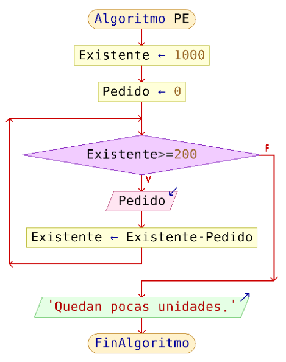

# Ejercicios
### Control de Flujo Iterativo
<small>
Created by <i class="fab fa-telegram"></i>
[edme88]("https://t.me/edme88") & 
<i class="fab fa-telegram"></i>
[rmarku]("https://t.me/rmarku")
</small>

---
### TP3: Ejercicio 1
Sumatoria de los números enteros comprendidos entre el 1 al 10.
* Usando While
* Usando Do While

---
### TP3: Ejercicio 2
Sumatoria de los números enteros comprendidos entre el 1 al 10.
* Usando For

---
### TP3: Pseudocodigo - Ejercicio 1
Existen 1000 unidades de un determinado producto. Mientras existan más de 200 se pueden seguir realizando entregas.
Si la cantidad baja de 200 debe notificarse un alerta.

---

---
### TP3: Pseudocodigo - Ejercicio 2
Escribe los 100 primeros números pares.

---
### TP6: While - Ejercicio 1
Queremos conocer los gastos de nuestro último viaje. Permita al usuario ingresar todos los gastos deseados.
El programa mostrará la sumatoria de los mismos cuando el usuario ingrese un valor negativo.

---
### TP6: While - Ejercicio 2
Permita al usuario ingresar cualquier cantidad de notas. El proceso finalizará cuando se ingrese un ‘0’.
Posteriormente, calculará el promedio de las notas.

---
### TP6: While - Ejercicio 3
Muestre por pantalla la tabla de multiplicación del número que ingrese el usuario. Para definir hasta que
número desea que muestre la tabla de multiplicación el usuario también deberá ingresar este valor.
La tabla de multiplicación a mostrar debe empezar en la multiplicación por 1.

---
### TP6: Do While - Ejercicio 4
Muestre por pantalla la tabla de multiplicación del número que ingrese el usuario. Para definir hasta que número
desea que muestre la tabla de multiplicación el usuario también deberá ingresar este valor. La tabla de
multiplicación a mostrar debe empezar en la multiplicación por 1.

---
### TP6: Do While - Ejercicio 5
Calcule el aumento de sueldo de para un grupo de empleados teniendo en cuenta el siguiente criterio: Si el
sueldo es inferior a $18000, aumento de 15%, Si el sueldo es mayor o igual a $18000, aumento del 12%.

---
### TP6: For - Ejercicio 6
Permite ingresar 12 números por teclado. Cuenta la cantidad de veces que se ingreso el cero.

---
### TP6: For - Ejercicio 7
Determinar el mayor y el menor entre diez números enteros distintos.

---
### TP6: For - Ejercicio 8
El programa debe calcular el factorial de un número N que ingrese el usuario.

---
### TP6: For - Ejercicio 9
Permita ingresar 10 notas por teclado, y que determine si está aprobado (4 o más) o no. Contabilice la cantidad
de aprobados, la cantidad de desaprobados, y el promedio.

---
### TP6: For - Ejercicio 10
Ingresar 8 números por teclado. Contabilizar la cantidad de pares, impares y nulos.

---
### TP6: For - Ejercicio 11
Ingresar la cantidad de trabajadores de la empresa. Posteriormente, ingresar sus sueldos. Calcular el monto que
la empresa invierte en sueldos.

---
### TP6: For - Ejercicio 12
Permite al usuario ingresar un número. Verifica si el número es o no primo. Imprime por pantalla el texto “Es primo” ó “No es Primo”.

---
### TP6: Ejercicio Extra 13
El programa debe imprimir los términos de la siguiente serie: 2,5,7,10,12,15,17 (hasta llegar a 100).

---
### TP6: Ejercicio Extra 14
Un vendedor hizo una serie de ventas y desea conocer aquellas de $200 o menos, las mayores a $200 pero inferiores
a $400, y las de $400 o más. El programa debe permitir ingresar el número de ventas, el monto de cada una.
Finalmente, mostrar la cantidad de ventas de cada categoría.

---
### TP6: Ejercicio Extra 15
El usuario debe poder ingresar un número N, y el programa muestra como salida el resultado de la siguiente serie:
1-1/2+1/3-1/4+…±1/N

---
### TP6: Ejercicio Extra 16
La sucesión de Fibonacci es una sucesión infinita de números naturales: 0,1,1,2,3,5,8,13… La sucesión comienza
con los números 0 y 1, y a partir de los mismos, cada término es la suma de los 2 anteriores. El programa debe
permitir al usuario ingresar la cantidad de números de la sucesión que desea que se muestren (mínimo: 3).
Se debe imprimir por pantalla la cantidad de números de la sucesión de Fibonacci correspondiente.

---
### TP6: Ejercicio Extra 17
Según la “Conjetura de Ulam” se puede obtener una serie de números siguiendo las reglas: comenzar por cualquier
entero positivo. Si es par dividirlo por 2, si es impar multiplicarlo por 3 y agregarle 1. El programa debe
dejar al usuario introducir un número para comenzar, y debe imprimir por pantalla todos los números de la serie hasta llegar a 1.

---
### TP6: Ejercicio Extra 18
En una elección hubo 4 candidatos (con identificadores 1,2,3 y 4). El programa debe contar el número de votos
correspondientes a cada uno (y voto en blanco ‘cero’) y el porcentaje que obtuvo respecto al total de votantes.
El usuario ingresará los votos, indicando con -1 cuando haya terminado.

---
### TP6: Ejercicio Extra 19
En una estación meteorológica se llevan los registros mensuales de las lluvias de 3 regiones: norte, centro y sur.
El programa debe permitir ingresar estos datos, calcular el promedio de cada región, y la región con mayor lluvia.

---
### TP6: Ejercicio Extra 20
Calcular el valor de ∏ utilizando la siguiente serie: ∏=4/1-4/3+4/5-4/7+4/9-…
La diferencia entre la serie y ∏ debe ser menor a 0,0005. El programa debe imprimir el número de términos requeridos para obtener esa precisión.

---
## ¿Dudas, Preguntas, Comentarios?

