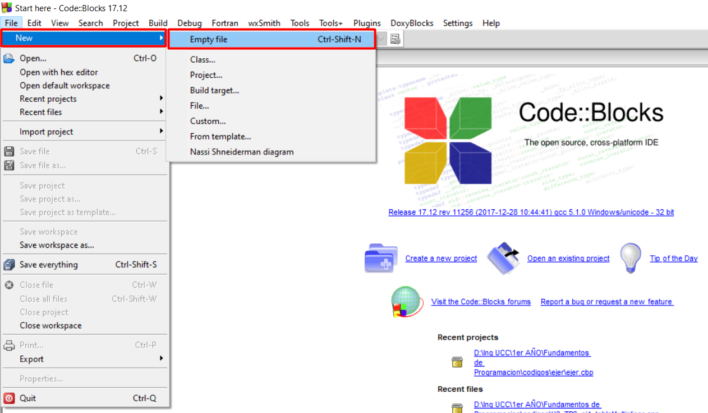
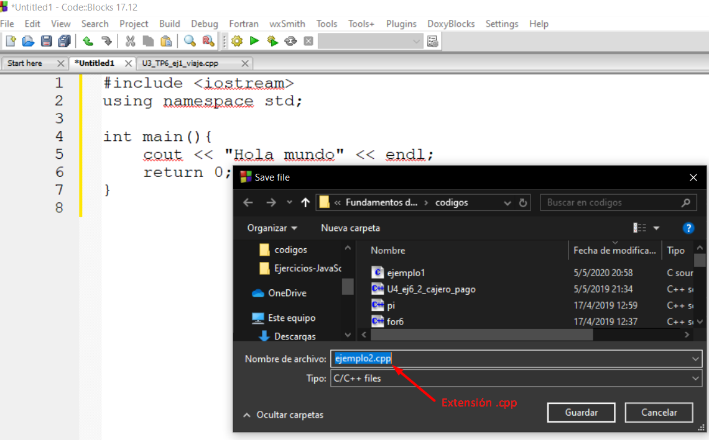
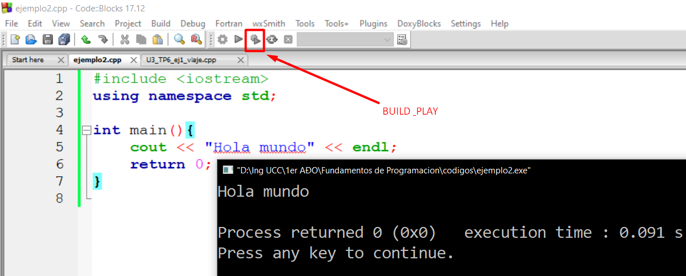
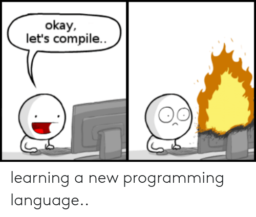

# Comenzar en C++
<small>
Created by <i class="fab fa-telegram"></i>
[edme88]("https://t.me/edme88")
</small>

---
## Code Blocks


---
## Comenzando
````javascript
/*
Fundamentos de Programacion
Autor: Nombre Apellido
Consigna
*/
#include <iostream>
using namespace std;

int main(){
    cout << "Hola mundo" << endl;
    return 0;
}
````

---
## Include
Instrucción al preprocesador que se usa para adicionar un archivo al código, como por ejemplo la llamada a una biblioteca 
de funciones en C++.

````javascript
#include <iostream>
````
Antes del proceso de compilación, el preprocesador es llamado primero a ejecutarse y buscar llamadas de instrucción 
al pre-procesador.

---
## Include
La instrucción **include** le indica al preprocesador que cuando este se ejecute, el compilador debe incluir un archivo en el código.

Este archivo suele ser: bibliotecas, secuencias, funciones y objetos, etc.

---
## Using namespace std
Al incluir la sentencia  
````javascript
using namespace std;
````
le estamos diciendo al compilador que usaremos el espacio de nombres std por lo que no tendremos que incluirlo 
cuando usemos elementos de este espacio de nombres, como pueden ser los objetos **cout** y **cin**, que representan el 
flujo de salida estándar (típicamente la pantalla o una ventana de texto) y el flujo de entrada estándar (típicamente el teclado).

---
## Using namespace std
````javascript
std::cout << "Hola";
````
Es lo mismo que:
````javascript
using namespace std;
cout << "Hola";
````

---
## Main
La función main sirve como punto de partida para la ejecución del programa. 
````javascript
int main(){
    
}
````

---
## Escribir
En pseudo código:
````javascript
Escribir "Hola Mundo!"
````
En C++:
````javascript
cout<<"Hola Mundo!"<<endl;
````

---
## Leer
En pseudo código:
````javascript
Leer num1
````
En C++:
````javascript
cin>>num1;
````

---
## Declarar variables
````javascript
int numEntero2;
float numComa4;
double numComa8;
char letra;
long numEntero4;
````

---
## Code Blocks: Guardar


---
## Code Blocks: Build and Run


---
#### Comenzando con un nuevio lenguaje...


---
## A tener en cuenta...
* Guardar con extensión **.cpp**
* Emplear **;** al final de cada oración
* Realizar un **build & play** si se realizaron cambios

---
## Ejercicios
Resuelve nuevamente los ejercicios del **Trabajo Practico I: Estructura Secuencial**, del 1 al 14 

---
## Librerias o Bibliotecas
Archivos que podemos incluir o importar en nuestro programa.

Estos archivos contienen especificaciones de diferentes funcionalidades ya construidas y utilizables que podemos
agregar a nuestro programa
````javascript
#include <math.h>
````

---
## [Math.h](http://www.cplusplus.com/reference/cmath/)
<!-- .slide: style="font-size: 0.8em" -->
Contiene algunas funcionalidades como:
* atan: arco tangente **atan(double x)** x en radianes
* pow: potencia. **pow(double base, double exponente)**
* sqrt: raiz cuadrada **sqrt(double x)**
* abs: valor absoluto **abs(double/float x)**
* sin: seno **sin(double/float x)** x en radianes
* cos: coseno **cos(double/float x)** x en radianes
* tan: tangente **tan(double/float x)** x en radianes

Tambien constantes:
* M_PI

---
## Ejercicios
Resuelve nuevamente los ejercicios del **Trabajo Practico I: Estructura Secuencial**, del 15 al 22 

---
## ¿Dudas, Preguntas, Comentarios?

