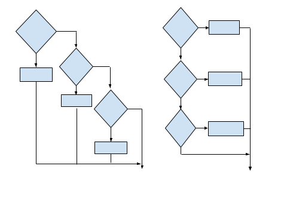

# Estructura Condicional o Selectiva

Created by <i class="fab fa-telegram"></i>
[edme88](https://t.me/edme88)

---
## Estructuras Selectivas
Estructura de control de gran utilidad para cuando el algoritmo a desarrollar presenta un número de posibles alternativas que resultan de la evaluación de una determinada condición.

Este tipo de estructuras son utilizadas para tomar decisiones lógicas, por ello también se denominan estructuras de decisión o alternativa.

---
## Estructuras Selectivas
Hay situaciones en las que la toma de decisiones se realiza en cascada. Es decir se toma una decisión, se marca la rama correspondiente a seguir, se vuelve a tomar otra decisión y así sucesivamente. Por lo que para alcanzar la solución de un problema o subproblema debemos aplicar prácticamente un árbol de decisión.

---
## Tipo de Estructura
Las estructuras selectivas/alternativas pueden ser:
* Simples: if (Si-Entonces)
* Dobles: if-else (Si-Entonces/Sino)
* Múltiples: switch (Si multiple)

---
## Alternativa Simple
* Si la condición es verdadera, entonces se realiza la acción o acciones necesarias.
* Si la condición es falsa no hace nada.


---
## Alternativa Simple: C/C++
````javascript
if(condicion){
    operación;
}
````

---
## Alternativa Doble
* Si la condición es verdadera, se ejecuta una acción y, si es falsa otra acción.


---
## Alternativa Doble: C/C++
````javascript
if(condición){
   operación1;
}
else{
    operacion2;
}
````

---
## Condicionales Múltiples: C/C++
Se puede emplear un **else if** para especificar una nueva condición si la primera condición es falsa.
````javascript
if(condición){
   operación1;
}
else if(condición2){
   operación2;
}//se pueden agregar todos los else if que sean necesarios
else{
    operacionN;
}
````

---
## Alternativa Múltiple
* La estructura de decisión múltiple evaluará una expresión que podrá tomar n valores distintos. 
El algoritmo seguirá un determinado camino de los n posibles.


---
## Alternativa Múltiple: C/C++
````javascript
switch(selector){
    case valor: 
               acción;
               break; //Evita evaluar los otros casos
    case valor2: 
               acción2;
               break;
    ....
    default: 
           acciónN;
           break;
}
````

---
## Alternativa Múltiple: C/C++
Se puede emplear para elegir un rango:
````javascript
switch(selector){
    case 1 ... 6: 
               cout<<"Numero entre 1 y 6"<<endl;
               break; //Evita evaluar los otros casos
    case 19 ... 25: 
               cout<<"Numero entre 19 y 25"<<endl;
               break;
    ....
    default: 
           cout<<"Numero que no esta comprendido entre 1 a 25"<<endl;
           break;
}
````

---
### Estructuras de decisión Anidadas
Una estructura **if / else** puede contener otra estructura **if / else** dentro, y así sucesivamente.
Las estructuras **if / else** interiores a otras estructuras if/else reciben el nombre de **anidadas**.



---
### Recuerda los Operadores Condicionales o Relacionales
Sirven para realizar comparaciones de igualdad, desigualdad y relación de menor o mayor.

<!-- .slide: style="font-size: 0.8em" -->
| Operador | Descripción |
|----------|-------------|
| == | Igual a |
| != | No igual a |
| > | Mayor que |
| >= | Mayor o igual que |
| < | Menor que |
| <= | Menor o igual que |

---
## Ejercicios
Resuelve nuevamente los ejercicios del **[Trabajo Practico II](https://ucc-fundamentosprogramacion.github.io/GTP/TP2_ejercicios.html#/1): Estructura Condicional**, del 3 al 33 

---
## ¿Dudas, Preguntas, Comentarios?

