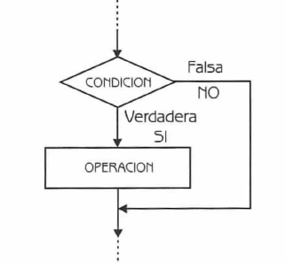

# Estructura Condicional
<small>
Created by <i class="fab fa-telegram"></i>
[edme88]("https://t.me/edme88") & 
<i class="fab fa-telegram"></i>
[rmarku]("https://t.me/rmarku")
</small>

---
## Conceptos básicos
Qué es un programa?

Cómo lo definirian con sus palabras?

---
## Alternativa Simple


---
## Alternativa Simple: C/C++
````javascript
if(condicion){
    operación;
}
````

---
## Alternativa Doble


---
## Alternativa Doble: C/C++
````javascript
if(condición){
   operación1;
}
else{
   operación2;
}
````

---
## Alternativa Múltiple


---
## Alternativa Múltiple: C/C++
````javascript
switch(selector){
    case <valor>: <acción>;
         break; //Evita evaluar los otros casos
    case <valor2>: <acción2>;
         break;
    ....
    default: <acciónN>;
         break;
}
````

---
## ¿Dudas, Preguntas, Comentarios?

