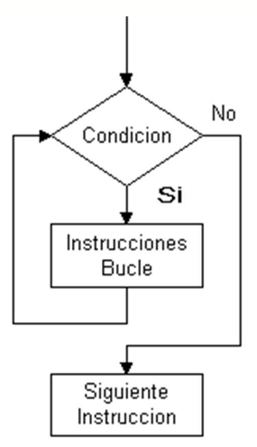
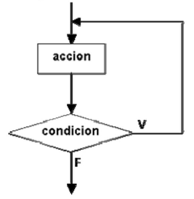
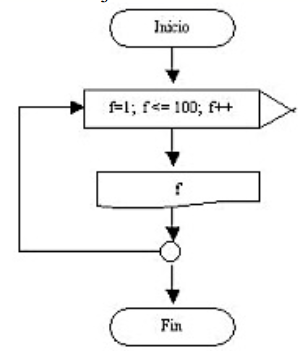

## Estructura Iterativa
<small>
Created by <i class="fab fa-telegram"></i>
[edme88]("https://t.me/edme88")
</small>

---
## Tipo de Bucles
* While (mientras)
* Do While (hacer mientras)
* For (para)

---
## While


---
## While: C/C++
````javascript
while(condición){
    acciones;
}
````

---
## Do While


---
## Do While: C
````javascript
do{
    acciones;
}
while(condicion);
````

---
## For


---
## For: C/C++
````javascript
for(int i=0; i < 100; i++){
    cout<<"Esta es la iteración número"<<i);
}
````

---
## ¿Dudas, Preguntas, Comentarios?

