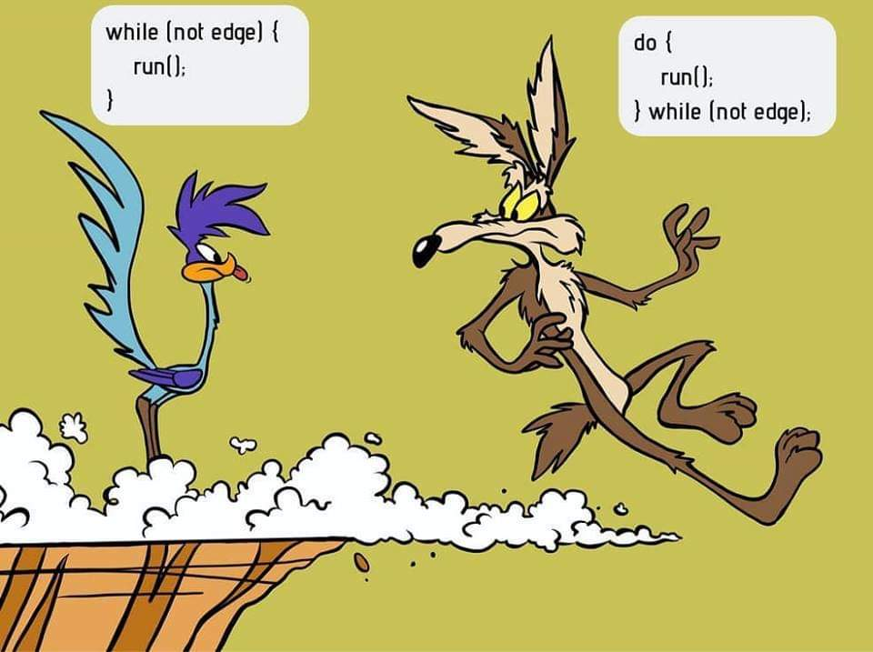
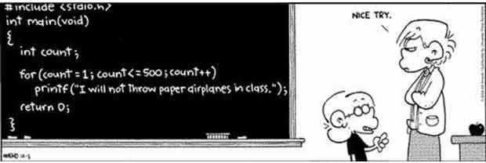

# Estructura Iterativa

Created by <i class="fab fa-telegram"></i>
[edme88](https://t.me/edme88)

---
## Estructuras Repetitivas o Iterativas
Este tipo de estructura de algoritmos que permite repetir una o varias acciones un número determinado de veces 
se denominan BUCLES, LAZO o LOOP, y cada repetición del bucle se llama iteración o ciclo.

Todo bucle tiene que llevar asociada una condición, que es la que va a determinar cuándo se repite el bucle y cuando deja de repetirse.
   
---
## Construcción de Lazos o Ciclos
Frecuentemente debemos efectuar en programación cálculos recurrentes. Esta situación se presenta cuando una misma operación (o serie de operaciones) se debe repetir dentro de un programa.

La misma se resuelve mediante el empleo de lazos o ciclos de programación. Es decir repetir una serie de cálculos un número finito de veces.

---
## Lazos
Para la construcción de lazos se deben utilizar al menos un contador y una decisión. Con el contador se
van registrando la cantidad de veces que se realiza la repetición y con la decisión se determina cuando se debe finalizar.

---
## Contador
Es una variable que cuenta. Generalmente se inicializa en cero antes de incializar un ciclo.
````javascript
int cont=0;
cont++;
cont+=1;
cont=cont+1;
````

---
## Acumulador
Es una variable que almacena datos de una suma continua. 
Su característica más común es que su valor suele ser siempre una suma o resta del valor actual con un dato nuevo.
````javascript
float acum=0;
float nota=0;
acum=acum+nota;
````

---
## Bandera
Es una variable tipo lógica que se incializa en VERDADERO ó FALSO.
Sirve para indicar que un determinado evento ocurrio.
````javascript
bool bandera=1;
bool bandera=true;
````

---


Bajo ninguna circunstancia hagas un loop infinito! LA COMPU VA A AUTODESTRUIRSE!!!

Bah, no es para tanto, pero nunca va a terminar el programa xD
   
---
## Tipo de Bucles
* While (mientras)
* Do While (hacer mientras)
* For (para)

---
## Operadores Condicionales o Relacionales
Sirven para realizar comparaciones de igualdad, desigualdad y relación de menor o mayor.

<!-- .slide: style="font-size: 0.8em" -->
| Operador | Descripción |
|----------|-------------|
| == | Igual a |
| != | No igual a |
| > | Mayor que |
| >= | Mayor o igual que |
| < | Menor que |
| <= | Menor o igual que |

---
## While


---
## While: C/C++
Esta estructura repetitiva “mientras”, es en la que el cuerpo del bucle se repite siempre que se cumpla una determinada condición.

````javascript
while(condición){
    acciones;
}
````

---
## Do While
Esta estructura es muy similar a la anterior, sólo que a diferencia del while el contenido del bucle se ejecuta siempre al menos una vez, ya que la evaluación de la condición se encuentra al final.

De esta forma garantizamos que las acciones dentro de este bucle sean llevadas a cabo, aunque sea una vez independientemente del valor de la condición.

---
## Do While


---
## Do While: C
````javascript
do{
    acciones;
}
while(condicion);
````
En las **acciones** suele haber alguna operación que afecte la condición (para llegar a una condición de corte).

---
#### While vs. Do While


---
## For
Permite ejecutar un conjunto de acciones para cada elemento de una lista, o para cada paso de un conjunto de  elementos.

Suele emplearse cuando se conoce a priori la cantidad de ciclos.


---
## For: C/C++
Podemos identificar tres componentes:
* inicialización
* condición de corte
* incremento

````javascript
for(int i=0; i < 100; i++){
    cout<<"Esta es la iteración número"<<i);
}
````

---
#### - Jaimito, escribi 500 veces "No arrojare aviones de papel en clase"
#### - Si, no hay problema Profe!


---
## Ejercicios
Resuelve nuevamente los ejercicios del **[Trabajo Practico III](https://ucc-fundamentosprogramacion.github.io/GTP/TP3_ejercicios.html#/1): Estructura Iterativa**, del 2 al 42 

---
## ¿Dudas, Preguntas, Comentarios?

