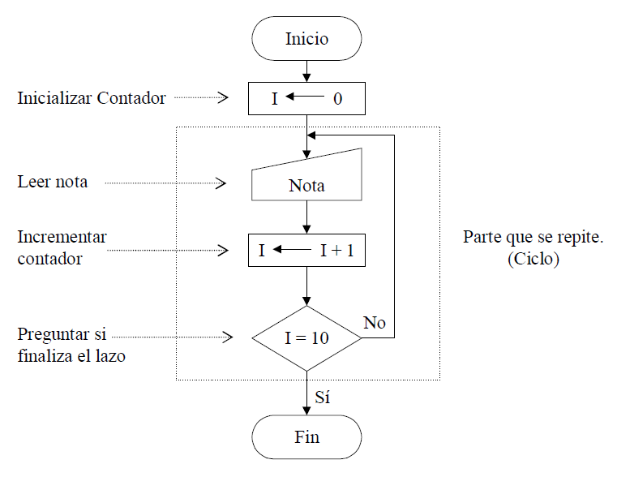

# Ejercicios
# Iterativos en C/C ++
<small>
Created by <i class="fab fa-telegram"></i>
[edme88]("https://t.me/edme88") & 
<i class="fab fa-telegram"></i>
[rmarku]("https://t.me/rmarku")
</small>

---
## Construcción de Lazos o Ciclos
Frecuentemente debemos efectuar en programación cálculos recurrentes. Esta situación se presenta cuando una misma operación (o serie de operaciones) se debe repetir dentro de un programa.

La misma se resuelve mediante el empleo de lazos o ciclos de programación. Es decir repetir una serie de cálculos un número finito de veces.

---
## Lazos
Para la construcción de lazos se deben utilizar al menos un contador y una decisión. Con el contador se
van registrando la cantidad de veces que se realiza la repetición y con la decisión se determina cuando se debe finalizar.

---
### DF Creación programa

---
## ¿Dudas, Preguntas, Comentarios?

