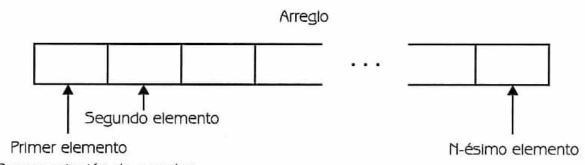

# Arreglos
<small>
Created by <i class="fab fa-telegram"></i>
[edme88]("https://t.me/edme88") & 
<i class="fab fa-telegram"></i>
[rmarku]("https://t.me/rmarku")
</small>

---
## Arreglo
Conjunto de datos del mismo tipo que se almacenan en memoria de manera contigua con el mismo nombre.

Para diferenciar los elementos de un arreglo se utilizan índices detrás del nombre del arreglo y encerrados por [].

---
## Arreglo
Si es arreglo se llama **a**, a[0] es el elemento que está en la posición **0**, a[1] está en la posición 1, a[i-1] está en la posición i-ésima.
Los elementos van de a[0], a[1],...,a[n-1]

````javascript
tipo nombreArray[numeroDeElementos];
````
Ejemplo: 
````javascript
char nombre[4];
````

---
## Arreglo
Colección finita, homogénea y ordenada de elementos.
* **Finita:** todo arreglo tiene un límite, es decirse debe determinar cuál será el número máximo de elementos que podrán formar parte del arreglo.
* **Homogénea:** todos los elementos de  un arreglo son del mismo tipo (todos enteros, todos reales, etc., pero nunca una combinación de distintos tipos). 
* **Ordenada:** Se puede determinar cuál es el primer elemento,  el segundo, el tercero,... y el n-ésimo elemento

---
## Arreglo 


---
## Arreglo: Partes
* **Componentes:** Elementos que lo forman.
* **Índice:** Índice de elemento


---
## Arreglo 
````javascript
int arr[3];
int arr[]={2,32,89};
//Es lo mismo que decir
arr[0]=3;
arr[1]=32;
arr[2]=89;
````

---
## Arreglo 
````javascript
//Se pueden asignar constantes simbólicas como valores numéricos
const int ENE=31, FEB=28, MAR=31, ABR=30, MAY=31, JUN=30, JUL=31, AGO=31, SEP=30, OCT=31, NOV=30, DIC=31;

int meses[12]={ENE, FEB, MAR, ABR, MAY, JUN, JUL, AGO, SEP, OCT, NOV, DIC};
````

---
## Arreglo: Operaciones
* Lectura/Escritura
* Asignación
* Actualización (inserción, eliminación, modificación)
* Ordenación
* Búsqueda


---
## Operación: Lectura
Leer el valor de cada uno de sus elementos.

````javascript
int arr[]={3,4,6,7,8,9};

for(int i=0;i < 6; i++){
    cout<<arr[i]<<endl;
}
````

---
## Operación: Escritura
Escribir el valor de cada uno de sus elementos.

````javascript
int arr[5];

for(int i=0;i < 5; i++){
    cin>>&arr[i];
}
````

---
## Operación: Asignación
No es posible asignar directamente un valor a todo el arreglo, sino que se debe asignar el valor deseado a cada componente.

---
## Tipo de Arreglos
* **Unidimensionales o Lineales:** Cualquier elemento es referenciado por un único  índice.
* **Multidimensionales:**  El número de dimensiones (índices) que se deben de utilizar en un arreglo depende del problema que debemos resolver

---
## Array Bidimensionales
También se conocen como Tablas o Matrices.
````javascript
tipo nombreArray[numeroFilas][numeroColumnas];
int a[4][6];
````

---
## Array Bidimensionales
| a[4][7] | C | O | L | U | M | N | A |
|---------|---|---|---|---|---|---|---|
| F | a[0][0] | a[0][1] | ... | ... | ... | a[0][5] | a[0][6] | 
| I | ... | ... | ... | ... | ... | ... | ... |
| L | ... | ... | ... | ... | ... | ... | ... |
| A | a[3][0] | a[3][1] | ... | ... | ... | a[3][5] | a[3][6] | 

---
## Array Bidimensionales
````javascript
int ejemplo[2][3] = {1,2,3,4,5,6};
int ejemplo[2][3] = {{1,2,3},{4,5,6}};
````

---
## Array Bidimensionales: Leer
````javascript
int ejemplo[2][3] = {{1,2,3},{4,5,6}};

for(int f=0;f < 2; f++){
    for(int c=0; c<3; c++){
        cout<<ejemplo[f][c];
    }
}
````

---
## Array en funciones
Los arrays se pasan por referencia.
````javascript
float suma(float a[5]);
float calcula(float a[], int n);
````

---
## ¿Dudas, Preguntas, Comentarios?
