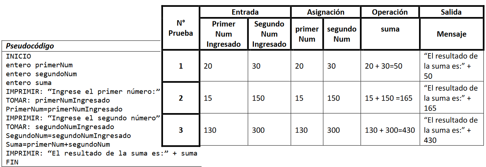

# Ejercicios
### Diagramas de flujo
<small>
Created by <i class="fab fa-telegram"></i>
[edme88]("https://t.me/edme88")
</small>

---
### Ejercicio: Estructura de   Control Secuencial
Disenar el digrama de flujo y realizar una prueba de escritorio.

Permita leer dos números desde el teclado (ancho y alto de un rectángulo); mostrar el perímetro y el área por pantalla.

---

---
## Pruebas de Escritorio  
Sirve para validar un algoritmo utilizando datos reales cómo ejemplo, para comprobar si se obtiene el resultado deseado.
    
El proceso para realizar una prueba de escritorio consiste en hacer seguimiento de un algoritmo recorriendo sus líneas secuencialmente,  simulando  el  funcionamiento  de  la  computadora.
    
A medida que se van recorriendo las líneas se anotan en una tabla auxiliar los valores que van tomando las variables.
    
---
## Pruebas de Escritorio
Para elaborarlo se deben distinguir las variables:
* Entrada
* Auxiliares
* Salida

Se debe distinguir el valor que toma cada una de ellas a medida que se realizan las operaciones del algoritmo.

---
## Pruebas de Escritorio
| Tipo de Variable | Tipo de Dato | Nombre de Variable |
|------------------|--------------|--------|
| Entrada | entero | Edad |
| Entrada | caracter | nombreUsuario |
| Auxiliar | real | nota |
| Salida | logico | habilitado |

---
## Pruebas de Escritorio: Ejercicio
Escribir un algoritmo quepermita realizar una suma de dos números enteros. El usuariodeberá ingresar  primero  un  número,  luego  el  siguiente  número,  y  el  sistema  arrojará  el  resultado correspondiente.

---

    
---
### TP1: Ejercicio 1
Determinar la hipotenusa de un triángulo rectángulo conocidas las longitudes de sus dos catetos.

---
### TP1: Ejercicio 2
Explique qué hacen los siguientes diagramas de flujo que posee una estructura secuencial.

Tradúzcalo a Pseudocódigo y realice pruebas de escritorio.

---

---
### TP4: Ejercicio 1
Dada una determinada temperatura en grados Farenheit, muestre por pantalla el valor de la misma en grados Celsius.

Recuerde que: C=(F-32)/1,8

---
### TP4: Ejercicio 2
Permite ingresar el sueldo bruto de una persona. Muestra por pantalla su sueldo neto (-17%) y los aportes jubilatorios (11%), de obra social (3%) y de PAMI (3%).

---
### TP4: Ejercicio 3
Permite que el usuario ingrese 2 números enteros.

El sistema el sistema mostrará por pantalla la suma y multiplicación de ambos números.

---
### TP4: Ejercicio 4
Permita ingresar el valor del radio de un círculo por teclado.
Debe mostrar por pantalla el valor del perímetro y del área.
Recuerde que CirAre=π×r^2 y el perímetro puede calcularse como CirPer=2×π×r

---
### TP4: Ejercicio 5
Permita leer dos números desde el teclado (ancho y alto de un rectángulo); mostrar el perímetro y el área por pantalla.

---
### TP4: Ejercicio 6
El cajero debe poder ingresar el monto de dinero a pagar y el monto de dinero que entregó el cliente.
Debe salir por pantalla el resultado del cambio que debe ser devuelto.
(se asume que el cliente paga un monto mayor al precio del producto)

---
### TP4: Ejercicio 7
Permite ingresar una distancia en millas y devuelve el valor en kilometros. Recuerde que 1 milla = 1,609 km.

---
### TP4: Ejercicio 8
En una gasolinera, los surtidores registran los galones de combustible “surtidos”.
Pero los cajeros registran el precio en litros. Suponiendo que el precio del combustible es $42,32 y sabiendo que 1 galón es equivalente a 3,378541 litros, diseñe el algoritmo que permita a los cajeros cobrar.

---
### TP4: Ejercicio 9
El número de sonidos emitidos por un grillo en un minuto es una función de la temperatura. T=(N/4)+40, donde T
es la temperatura en grados Fahrenheit y N es el número de sonidos emitidos por minuto.
El programa debe permitir ingresar el valor N y debe mostrar la temperatura en grados Celsius y Fahrenheit.

---
### TP4: Ejercicio 10
Dado 2 valores: radio y altura de un cilindro, calcule su área y su volumen.
Recuerde que el volumen de un círculo puede calcularse como Vc=π×r^2×h y el área puede calcularse como Ac=2×π×r×h

---
### TP4: Ejercicio 11
Calcule la cantidad de segundos que hay en una determinada cantidad de días (que deben ser ingresados por teclado).

---
### TP4: Ejercicio 12
Dados 3 lados de un triángulo, el programa debe mostrar por pantalla su área.
Recuerde que puede aplicar las siguientes fórmulas: Á=S×(S-L1)×(S-L2)×(S-L3) donde S=(L1+L2+L3)/2

---
### TP4: Ejercicio 13
Dado 2 puntos en un espacio bidimensional P1=X1,Y1 y P2=X2,Y2 , calcule la distancia entre ambos.
Recuerde que D=((X1-X2)^2+(Y1-Y2)^2)^(1/2)

--
### TP4: Ejercicio 14
Permite ingresar 3 valores: a (termino cuadrático), b (coeficiente lineal) y c (término independiente).
El programa debe mostrar por pantalla el valor de las 2 raíces. Recuerde que para la ecuación de segundo grado
ax2+bx+c=0 las raíces se calculan a partir de la fórmula x=(-b±(b^2-4ac)^(1/2))/2a

---
## ¿Dudas, Preguntas, Comentarios?

