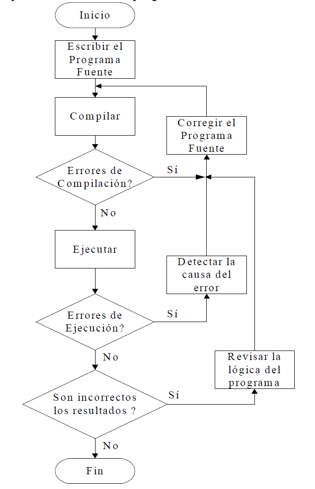
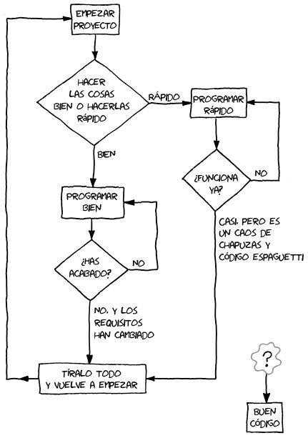

# Ejercicios
# C/C ++
<small>
Created by <i class="fab fa-telegram"></i>
[edme88]("https://t.me/edme88")
</small>

---
### DF Creación programa


---
## Contador
A la izquierda de una sentencia de asignación sólo puede figurar una constante ó variable.
    
Lo que está a la derecha de la sentencia de asignación se valúa y el valor obtenido se le asigna a la constante o variable que figura a la izquierda de la misma.
    
---
## Sumador
Es una variable que se utiliza para ir sumando o acumulando datos.

Cuando se trabaja con sumadores, siempre se les debe asignar un valor inicial (inicializar).

Después de inicializados, se van sumando los valores deseados.

---
## Sumador: Ejemplo
| Asignación | Valor de SUMA |
|------------|---------------|
| Suma = 0 | 0 |
| Suma = suma+20 | 20 |
| Suma = suma+30 | 50 |
| Suma = suma+10 | 60 |

---
### Programa
Todo programa tiene un nombre que lo define y debe ser representativo de la función que cumplen.

Es recomendable escribir un párrafo como comentario de lo que realiza el programa.

También se pueden definir las constantes y variables que utilizaremos en el desarrollo de la solución.

---
### Programa
````javascript
/*NOMBRE DEL PROGRAMA
* Descripción de que hace
* Version: 2.1
* Fecha: 04/03/2019
*/

#include <iostream>

int main() {
    //Comentario en línea independiente. Declaración de la variable edad
    int edad;
    edad=54; //Comentario en línea junto a código. Asignación de valor a la variable edad
    cout<<"La edad es "<<edad<<endl;
    cout<<"Gracias por utilizar este programa"<<endl;
    /* Finalizamos el programa, comentario en bloque en una sola línea */
    return 0; /*Sentencia return de terminación, comentario en bloque en una sola línea*/
}

````
    
---


---
## ¿Dudas, Preguntas, Comentarios?

